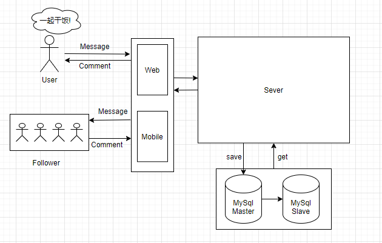
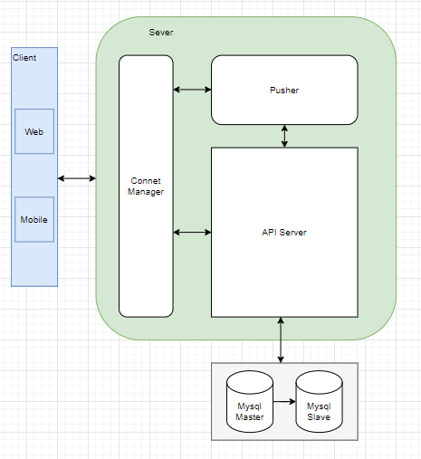
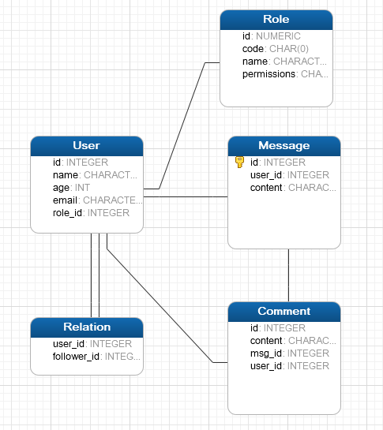

代码未动，文档先行，这是一个优秀码农的基本修养。

下面以一个Buzz(我自己随便臆想出来的类Twitter应用)为例, 展示一种**设计文档**的结构，供大家参考。
因为文档是从国际友人那里借鉴的，我翻译能力有限，所以文档会中英文夹杂。

### 1. Introdruction
The purpose of this document is to layout all the details of the development process which will help lay down all the basics for the software development cycle.

#### 1.1 Purpose
   Buzz的目的是建立一种基于用户关系的社交媒体平台，用户可以通过多种终端接入，以文字、图片等多媒体形式，实现信息的即时分享，互动传播。
#### 1.2 Scope
Buzz会做的事：
   - 用户账户体系及用户关系管理
   - 用户信息订阅分发(140字以内)
   - 热点推荐

#### 1.3 Out of Scope
Buzz不会做的事:
   - 私人社群
   - 新闻分发

#### 1.4 Limitations
- Buzz的目标用户只是中国大陆，在设计时不考虑全球可用性

#### 1.5 Dependency
- Buzz会依赖公司的分布式任务调度中心(DTS)进行任务调度与发布
- Buzz依赖公司的配置中心进行非业务配置动态下发。

### 2. Core Elements(核心元素)
- Users：用户分为普通使用用户，管理员用户，系统用户等。每种用户都有相应权限。
- Mico-Blog: 是指用户发布的信息。MB由用户发布，每个关注该用户的用户都可以查看该Mico-Blog
- Comment: Comment由是对Mic-Blog的评论，也可以是对另外一条Comment的评论。

注意：这里的Elements和系统组件是两个东西，是指系统概念元素。

### 3. Use Cases
**普通用户:** 普通用户通过Buzz发布消息和动态，他的订阅者能及时接收到。普通用户间可以相互关注(多对多),订阅者能即时的在自己的信息流里接收到自己订阅的用户的消息

**审核员:** 管理员可以根据法律法规，审核任何一个普通用户的消息，并可执行删除和封禁动作

### 4. Data Flow

### 5. Design Overview
#### 5.1 Core Components

这里有四个核心组件：

**Client:**
  - 用户的终端统称为Client, 包括Web版，Mobile版的，Clinet负责与用户交互。
  - 不同平台的Client使用的用户终端使用的API是相同的

**Connet Manager:**
  - 这个一个长连接管理器，是一个被独立部署的服务，他可以被部署在多个数据服务中心，为用户提供更流畅的接入服务。
  - 他负责管理和Client之间的长连接，具有流量监控审计和重连功能。

**API Server:**
  - 提供复合Restful格式的API服务
  - Auth认证服务
  - Message管理服务

**Pusher:**
  - Pusher是一个需要独立部署的服务。负责主动向用户推送消息。

#### 5.2 System Architecture
这里要把每个core Component的内部设计更展开的讲讲

### 6. DataBase Design

注：使用Navcat设计，但是线条之间没有展示外键关系，我也不知道该怎么设置

### 7. Technical Details

### 7.1 技术栈
- MySQL7.0
- React for Web UI
- Swift for IOS Client
- Spring boot/Java for backend
- Maven as build tool
- Jekins as CI/CD tool

### 7.2 环境
Buzz会有四个部署环境

**DEV:** 该环境用于开发人员开发测试，连接的数据库为DEV专用数据库

**QA:** 该环境用于QA团队使用，承载功能测试，回归测试等功能。

**UAT:** 该环境用于预发布环境，供公司内其他使用到Buzz的项目做集成测试用。

**PROD:**: 该环境用于生产。必须使用独占的database，该database必须具有主从备份功能。且该database的密码只有运维人员管理。

### 7.3 Servers
Dev只有一个服务器实例，所有组件都部署在同一台机器上。

QA和UAT会有2个服务器实例，ConnectManager和Pusher部署在同一台机器上，API-Server和Web-UI部署在同一台机器上。

PROD环境都必须有6台服务器实例。3台机器都要同时部署UI和后端service，另外三台同时部署ConnectManager和Pusher

### 7.4 CI/CD
我们的代码会托管在gitlab, 并使用jekins的pipeline作为CI/CD工具。对UAT, QA, UAT环境的，
开发测试人员可以自助发布。对Prod环境的发布，需要遵循以下流程：
- 开发人员提前一周周对所有相关工程师发送发布预告，所有变动应尽量兼容。如有不兼容的发布应提前一周发布预告，并让以来该服务的团队一一确认。
- Team Leader把经回归测试ok的代码分支review后，合并到master上，然后打上tag, 编译提交编译包。
- Engineer 提Jira到运维部，经Team Leader批准，运维部安排人员执行发布。

#### 7.5 Code Repository
我们使用gitlab作为源码仓库，有如下几个分支：
- master: 这是主分支，tag只能在 master上打。this branch will always have the code that is in Production. 
- uat: uat分支用于部署到uat环境。
- dev: dev分支用于部署QA和DEV. SonarQube应该监控这个分支。
- feature/xxxx: 该分支应该从dev分支copy而来，用于开发新特性。
- bugfix/xxxx: 分支应该从dev分支copy而来，用于修复非紧急bug
- hotfix/xxxx: 分支应该从master分支copy而来，用于需要立马修复并上线的bug。

feature,bugfix,hotfix分支在合并到master之后，应及时删除。

#### 7.6 代码质量
在整个开发周期内，代码质量都会被严格监控。每次代码合并到uat之前，都应该由TeamLeader做严格的Review.

我们使用SonarQube去监控测量代码质量。SonarQube会每天发送质量报告到每个相关人员(包括管理人员)邮箱。

我们要求70%的单元测试覆盖率。当代码合并到uat分支时，回归测试和单元测试在jenkins中中会自动触发。

### 8. Other Requirements
#### 8.1 Monitoring
API-Server的健康检查接口为/ping, 该接口应该返回的status code为200, 应该没隔1min检查依次。

#### 8.2 Log
所有服务器端组件的日志都打印在本地的滚动文件中，文件名{componentName}-{date}.{no}.log,
该文件最大为500M, 且具有自动滚动功能。日志应该有公司的Log系统收集存储，并提供集中检索服务。

#### 8.3 Volume estimation
这里要评估用户量，数据量等。

#### 8.5 Auditing

#### 8.6 High Availability
- 系统的每个组件都要支持多实例部署
- db需要采用主从部署，且主从切换时间不应大于1min
其实我觉得高可用设计单独展开就是一篇文档了

